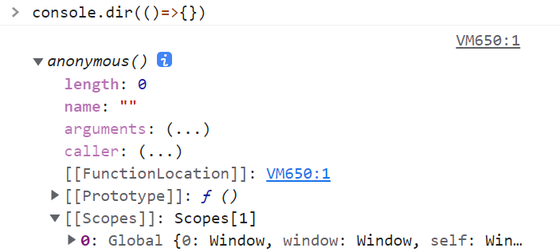

# 第5章 基本引用类型

这一章只花了最开始的一小部分来介绍JS里对象的一些特性，例如：

* JS里没有真正意义上的类（ES6引入的Class只能算是利用JS原型链模拟的类，不算真正的类）
* 引用类型和对象实例之间是构造器和被构造对象的关系
* 我们通常使用"new 构造函数()"的方式来创建一个只有默认属性和方法的简单对象

但是在红宝书的这一章里，除了最前面这一小节，其他的篇幅总的来说就介绍了JS内置的几种内置标准对象：Date，RegExp，String，Boolean，Number。

不知道红宝书作者为何要如此编排，把Date作为第一个大家见到的内置对象，就会让很多刚刚学习JS的人认为Date是很重要的一种类型。但是Date里面巨多无比又难以记忆的方法不知道劝退了多少人。

现在我看来以Date自身的重要性来看远远没有必要放在这个章节的第一节, 也没有必要专门深入讲解Date里的各种方法，另外关于其他内置对象的其他介绍又真的太少了，所以我去查了MDN的《标准内置对象》：

[https://developer.mozilla.org/zh-CN/docs/Web/JavaScript/Reference/Global\_Objects](https://developer.mozilla.org/zh-CN/docs/Web/JavaScript/Reference/Global\_Objects#%E6%A0%87%E5%87%86%E5%86%85%E7%BD%AE%E5%AF%B9%E8%B1%A1%E5%88%86%E7%B1%BB)

MDN里面对于JS里的对象分类全面，而且非常精准。所以我建议大家学习内置对象，不要参考红宝书里的章节排布，而是参考上面的链接。另外，建议读者在学习各种基本引用类型的时候不要太依赖于书籍，最好是自己去查一查官方文档，动手去试一试里面的对象和方法到底有什么用。

首先我们要明确标准内置对象的含义：就是JS内部自带的，你可以在全局任意位置调用的对象。包括他们的方法和属性。对于内置对象，我们既可以把它作为构造函数来创建一个对象的实例(例如new Date())，也可以使用该内置对象的静态方法来完成其他操作(例如Date.now())。

## 5.1 对象分类

### 5.1.1 值属性

MDN将全局能访问到的特殊值也作为对象被分类进来了。这些特殊值大家在第三章有的已经见过了。这些值作为对象，没有自己的属性和方法。并且这些虽然被称为“对象”，但是除了globalthis,使用typeof会显示他们的类型并不是object。所以我们怎么理解这也是内置对象的一种分类呢？我的个人理解是MDN把所有能够全局访问的变量，函数，对象都涵盖进了“标准内置对象”中，这里的对象是语文当中的“对象”而非JS中的object。

其实全局能访问到的值和函数，就是我们的顶层对象global的值和方法。

.png>)

| 值属性对象      | 用法                 | 备注 |
| ---------- | ------------------ | -- |
| Infinity   | 无穷大                |    |
| NaN        | 非数字                |    |
| globalthis | 在任何位置都可以直接访问global |    |
| undefined  | 未定义                |    |

### 5.1.2 函数属性

与值属性一样，global对象也具有以下方法。

| 函数属性对象               | 用法                                                 | 备注                  |
| -------------------- | -------------------------------------------------- | ------------------- |
| eval()               | 执行传入的字符串                                           |                     |
| uneval()             | 将一个对象转换成创建它的字符串，eval()的逆过程                         | 非标准函数               |
| isFinite()           | 值是否小于JS能储存的最大值                                     |                     |
| isNaN()              | 判断一个值是否为NaN                                        | 不要与Number.isNaN（）混淆 |
| parseFloat()         | 字符串转浮点数                                            |                     |
| parseInt()           | 字符串转整数                                             |                     |
| decodeURI()          | 能解码由encodeURI 创建或其它流程得到的统一资源标识符（URI）               |                     |
| decodeURIComponent() | 解码由 encodeURIComponent方法或者其它类似方法编码的部分统一资源标识符（URI）。 |                     |
| encodeURI()          | 将提供的字符串编码为统一资源标识符 (URI)                            |                     |
| encodeURIComponent() | 将提供的字符串编码为统一资源标识符 (URI)                            |                     |

### 5.1.2 基本对象

JS里又把以下基本引用类型放入了基本对象当中，也就是JS里最最最常用的对象。

| 对象名      | 对象含义               | 备注          |
| -------- | ------------------ | ----------- |
| Object   | JS里的最基本的引用类型       |             |
| Function | 函数本身也是一个对象，毕竟是一等公民 |             |
| Boolean  | 布尔值对象              |             |
| Symbol   | Symbol对象的构造器       | 不支持使用new关键词 |

Boolean和Symbol因为无法归入后面的“字符串对象”，“数字对象”，所以被归入了基本对象，但是很明显，他俩跟Object和Function来比远远不够“基本”。

### 5.1.3 错误对象

我们平时跑程序抛出的错误都是对象。以下就是JS里给你预设好的一些错误对象。

| 对象名            | 对象含义         | 备注                               |
| -------------- | ------------ | -------------------------------- |
| Error          | 最一般的错误对象     | 其他的所有错误对象都继承该对象                  |
| AggregateError | 表示一个复合型的错误   | 尚在实验当中                           |
| EvalError      | 由eval()抛出的错误 | 现在已不会被JS抛出                       |
| InternalError  | JS引擎内部错误     | 如果你的递归函数没有设置递归的结束条件，那么很有可能会抛出此错误 |
| RangeError     | 范围错误         |                                  |
| ReferenceError | 引用错误         | 在当前的执行上下文里没有找到引用的标识符             |
| SyntaxError    | 语法错误         | 代码出现了不该出现的字符，例如多了一个,{，）之类的字符     |
| TypeError      | 类型错误         | 值类型非预期类型时抛出的错误                   |
| URIError       | URI错误        | 向URI处理函数传递不合法URI时的错误             |

那这些对象很明显不只是JS引擎抛给你，你自己也可以使用try catch来捕获你自己抛出的错误实例。毕竟，以上的对象本身都是构造器，都是可以传参进去然后返回给你一个错误对象的。我们以Error来举一个例子。

```javascript
const e = new Error('this is an error made by tuntuncat') // 创建一个错误实例e

// 使用try catch测试一下
try{
    if(false) { // if是你的判断错误条件
        throw e
    }
} catch(e) {
    console.log(e.message)
} // this is an error made by tuntuncat
```

e会继承Error原型上的所有对象和方法。

.png>)

另外所有的次级Error对象都继承了Error:



